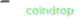
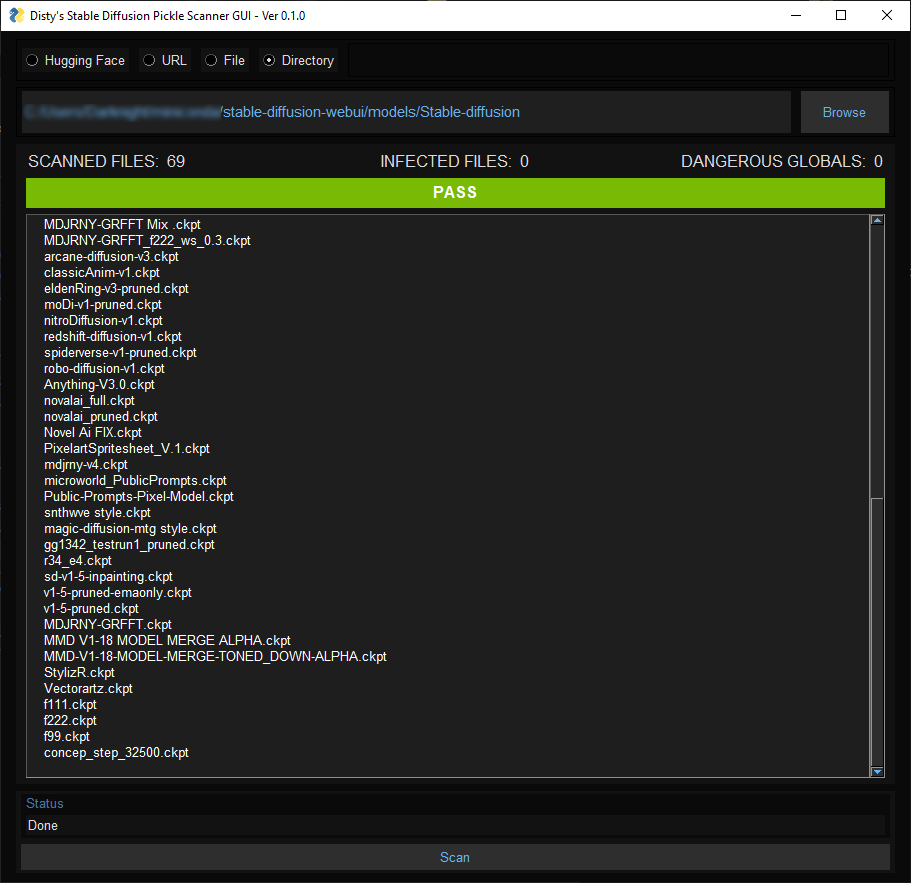
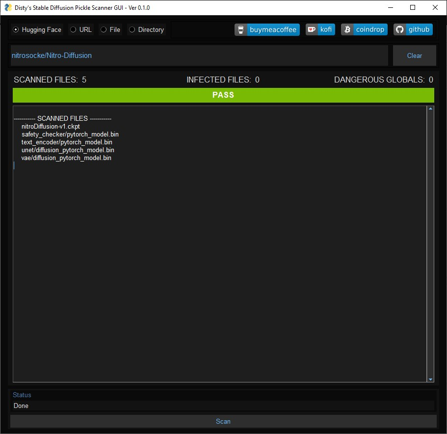
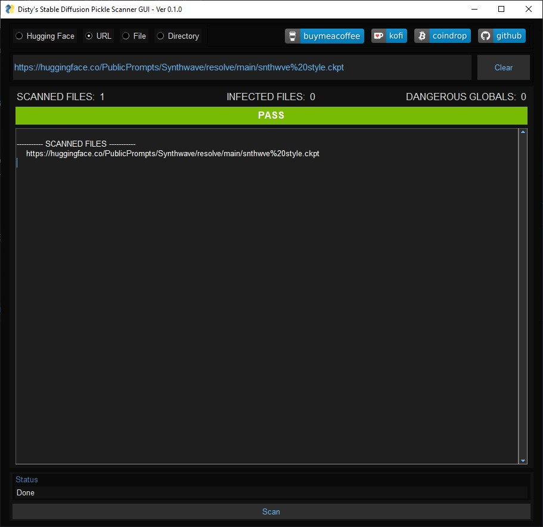
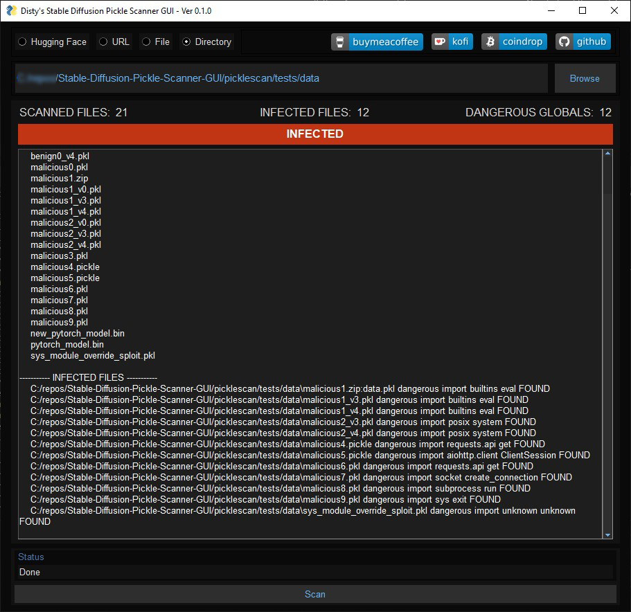

<!-- Improved compatibility of back to top link: See: https://github.com/othneildrew/Best-README-Template/pull/73 -->
<a name="readme-top"></a>
<!--
*** Thanks for checking out the Best-README-Template. If you have a suggestion
*** that would make this better, please fork the repo and create a pull request
*** or simply open an issue with the tag "enhancement".
*** Don't forget to give the project a star!
*** Thanks again! Now go create something AMAZING! :D
-->
<!--
*** I'm using markdown "reference style" links for readability.
*** Reference links are enclosed in brackets [ ] instead of parentheses ( ).
*** See the bottom of this document for the declaration of the reference variables
*** for contributors-url, forks-url, etc. This is an optional, concise syntax you may use.
*** https://www.markdownguide.org/basic-syntax/#reference-style-links
-->
<br />
<div align="center">

[](https://www.buymeacoffee.com/disty)
[](https://ko-fi.com/disty)
[](https://coindrop.to/disty)
  <h1 align="center">Stable-Diffusion-Pickle-Scanner-GUI</h1>

  <p align="center">
    Made simple and portable.
    <br />
    <br />
    <a href="https://github.com/diStyApps/Stable-Diffusion-Pickle-Scanner-GUI/issues">Report Bug</a>
    ·
    <a href="https://github.com/diStyApps/Stable-Diffusion-Pickle-Scanner-GUI/issues">Request Feature</a>
  </p>
</div>


<!-- TABLE OF CONTENTS -->
<details>
  <summary>Table of Contents</summary>
  <ol>
    <li>
      <a href="#about-the-project">About The Project</a>
    </li>
    <li><a href="#usage">Usage</a></li>
    <li><a href="#roadmap">Roadmap</a></li>
    <li><a href="#license">License</a></li>
    <li><a href="#contact">Contact</a></li>
    <li><a href="#acknowledgments">Acknowledgments</a></li>
  </ol>
</details>


<!-- ABOUT THE PROJECT -->
## About The Project




The project is a GUI for [picklescan](https://github.com/mmaitre314/picklescan) repo. Made simple and portable.

<p align="right">(<a href="#readme-top">back to top</a>)</p>

<!-- Downloads -->
## Downloads
Standalone version [Windows](https://github.com/diStyApps/Stable-Diffusion-Pickle-Scanner-GUI/releases/download/v0.1.0/distys-Stable-Diffusion-Pickle-Scanner-GUI.v0.1.0.exe) 

Archived version [Windows](https://github.com/diStyApps/Stable-Diffusion-Pickle-Scanner-GUI/releases/download/v0.1.0/distys-Stable-Diffusion-Pickle-Scanner-GUI.v0.1.0.zip) 

<p align="right">(<a href="#readme-top">back to top</a>)</p>


<!-- USAGE EXAMPLES -->
## Usage

### Hugging Face
Scan a malicious model on [Hugging Face](https://huggingface.co/):
```bash
nitrosocke/Nitro-Diffusion
```


### URL
Scan a malicious model from URL:
```bash
https://huggingface.co/PublicPrompts/Synthwave/resolve/main/snthwve%20style.ckpt
```


### File / Directory
Scan a malicious models from File or Directory:
```bash
/stable-diffusion-webui/models/Stable-diffusion
```


### Testing
Clone and scan a malicious files test directory:
```bash
/Stable-Diffusion-Pickle-Scanner-GUI/picklescan/tests/data
```



<p align="right">(<a href="#readme-top">back to top</a>)</p>


<!-- ROADMAP -->
## Roadmap

- [ ] Add model downloader
- [ ] Add models previews

See the [open issues](https://github.com/diStyApps/Stable-Diffusion-Pickle-Scanner-GUI/issues) for a full list of proposed features (and known issues).

<p align="right">(<a href="#readme-top">back to top</a>)</p>

<!-- LICENSE -->
## License

Distributed under the MIT License. See `LICENSE.txt` for more information.

<p align="right">(<a href="#readme-top">back to top</a>)</p>


<!-- CONTACT -->
## Contact

[@The_diSty](https://twitter.com/The_diSty) - distty@gmail.com

Project Link: [https://github.com/diStyApps/Stable-Diffusion-Pickle-Scanner-GUI](https://github.com/diStyApps/Stable-Diffusion-Pickle-Scanner-GUI)

<p align="right">(<a href="#readme-top">back to top</a>)</p>


<!-- ACKNOWLEDGMENTS -->
## Acknowledgments

Use this space to list resources you find helpful and would like to give credit to. I've included a few of my favorites to kick things off!

* [picklescan](https://github.com/mmaitre314/picklescan)
* [stable-diffusion-webui](https://github.com/AUTOMATIC1111/stable-diffusion-webui)
* [huggingface](https://huggingface.co)

<!-- * [GitHub Emoji Cheat Sheet](https://www.webpagefx.com/tools/emoji-cheat-sheet)
* [Malven's Flexbox Cheatsheet](https://flexbox.malven.co/)
* [Malven's Grid Cheatsheet](https://grid.malven.co/)
* [Img Shields](https://shields.io)
* [GitHub Pages](https://pages.github.com)
* [Font Awesome](https://fontawesome.com)
* [React Icons](https://react-icons.github.io/react-icons/search)-->

<p align="right">(<a href="#readme-top">back to top</a>)</p>


<!-- MARKDOWN LINKS & IMAGES -->
<!-- https://www.markdownguide.org/basic-syntax/#reference-style-links -->
[contributors-shield]: https://img.shields.io/github/contributors/othneildrew/Best-README-Template.svg?style=for-the-badge
[contributors-url]: https://github.com/othneildrew/Best-README-Template/graphs/contributors
[forks-shield]: https://img.shields.io/github/forks/othneildrew/Best-README-Template.svg?style=for-the-badge
[forks-url]: https://github.com/othneildrew/Best-README-Template/network/members
[stars-shield]: https://img.shields.io/github/stars/othneildrew/Best-README-Template.svg?style=for-the-badge
[stars-url]: https://github.com/othneildrew/Best-README-Template/stargazers
[issues-shield]: https://img.shields.io/github/issues/othneildrew/Best-README-Template.svg?style=for-the-badge
[issues-url]: https://github.com/othneildrew/Best-README-Template/issues
[license-shield]: https://img.shields.io/github/license/othneildrew/Best-README-Template.svg?style=for-the-badge
[license-url]: https://github.com/othneildrew/Best-README-Template/blob/master/LICENSE.txt
[linkedin-shield]: https://img.shields.io/badge/-LinkedIn-black.svg?style=for-the-badge&logo=linkedin&colorB=555
[linkedin-url]: https://linkedin.com/in/othneildrew
[product-screenshot]: images/screenshot.png
[Next.js]: https://img.shields.io/badge/next.js-000000?style=for-the-badge&logo=nextdotjs&logoColor=white
[Next-url]: https://nextjs.org/
[React.js]: https://img.shields.io/badge/React-20232A?style=for-the-badge&logo=react&logoColor=61DAFB
[React-url]: https://reactjs.org/
[Vue.js]: https://img.shields.io/badge/Vue.js-35495E?style=for-the-badge&logo=vuedotjs&logoColor=4FC08D
[Vue-url]: https://vuejs.org/
[Angular.io]: https://img.shields.io/badge/Angular-DD0031?style=for-the-badge&logo=angular&logoColor=white
[Angular-url]: https://angular.io/
[Svelte.dev]: https://img.shields.io/badge/Svelte-4A4A55?style=for-the-badge&logo=svelte&logoColor=FF3E00
[Svelte-url]: https://svelte.dev/
[Laravel.com]: https://img.shields.io/badge/Laravel-FF2D20?style=for-the-badge&logo=laravel&logoColor=white
[Laravel-url]: https://laravel.com
[Bootstrap.com]: https://img.shields.io/badge/Bootstrap-563D7C?style=for-the-badge&logo=bootstrap&logoColor=white
[Bootstrap-url]: https://getbootstrap.com
[JQuery.com]: https://img.shields.io/badge/jQuery-0769AD?style=for-the-badge&logo=jquery&logoColor=white
[JQuery-url]: https://jquery.com 


